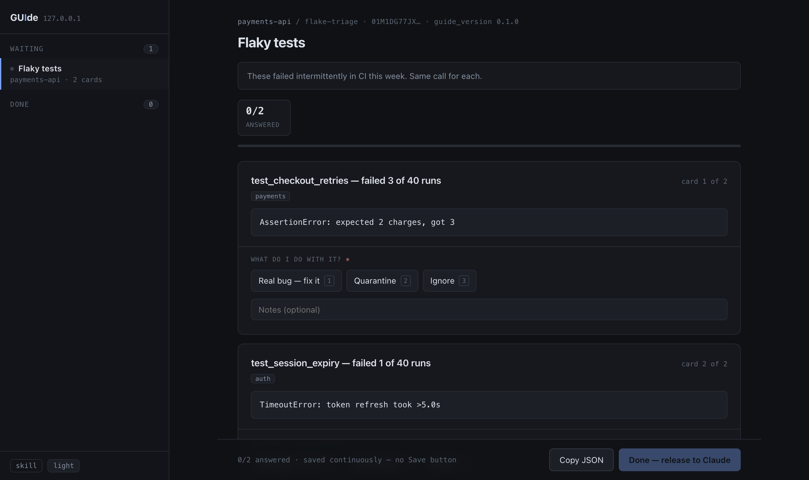

# GUIde

**A local inbox for the questions your agents need answered.**

Claude writes a JSON file: a list of questions, each carrying the evidence needed to
answer it. It pushes that to `guide`, running on your own machine. A browser page shows
an inbox of everything waiting — from every Claude session you have open — and renders
each question as a card with buttons. You click through them. It writes your answers
back to a JSON file. Claude reads it and keeps working.

That's the whole product.


## The loop, in four commands

```sh
guide push ./questions.json    # Claude: here are 8 things I need you to decide
guide open                     # you: click through them in a browser
guide wait <id>                # Claude: blocks until you press Done
guide read <id>                # → answers.json, structured and ready to act on
```

`push` starts the daemon if it isn't running, and returns immediately — the agent goes
off and does other work while you answer.

## Try it in one minute

```sh
# uv is a single static binary; it manages its own Python and touches nothing else
curl -LsSf https://astral.sh/uv/install.sh | sh

git clone https://github.com/AStrayByte/GUIde && cd GUIde
uv tool install --from . guide-cli                 # puts `guide` on your PATH, in its own env

guide push examples/verifier-triage.batch.json --open
```

Then `guide skill install` teaches Claude Code to use it. Want to read it first, or have
your agent install it? Open <http://127.0.0.1:7777/skill> — four ways in, including a
prompt you can paste into any Claude session.

> Not on PyPI yet — when it is, that install line becomes `uv tool install guide-cli`.
> `uvx --from . guide status` runs it without installing anything at all.

## A complete example

Two flaky tests, one decision each. Copy this into `flaky.json` — it's a real batch, and
strict JSON, so it pushes as-is:

```json
{
  "guide_version": "0.1.0",
  "title": "Flaky tests",
  "instructions": "These failed intermittently in CI this week. Same call for each.",
  "defaults": {
    "response": {
      "prompt": "What do I do with it?",
      "fields": [
        {
          "id": "action",
          "type": "choice",
          "required": true,
          "options": [
            { "value": "fix", "label": "Real bug — fix it", "key": "1" },
            { "value": "quarantine", "label": "Quarantine", "key": "2" },
            { "value": "ignore", "label": "Ignore", "key": "3" }
          ]
        },
        { "id": "note", "type": "text", "placeholder": "Notes (optional)" }
      ]
    }
  },
  "cards": [
    {
      "id": "t1",
      "title": "test_checkout_retries — failed 3 of 40 runs",
      "tags": ["payments"],
      "blocks": [
        { "type": "code", "code": "AssertionError: expected 2 charges, got 3" }
      ]
    },
    {
      "id": "t2",
      "title": "test_session_expiry — failed 1 of 40 runs",
      "tags": ["auth"],
      "blocks": [
        { "type": "code", "code": "TimeoutError: token refresh took >5.0s" }
      ]
    }
  ]
}
```

`defaults.response` is the ergonomic win: every card gets the same buttons, declared
once. A 200-card triage is 200 cards of evidence and exactly one copy of the response
spec. Any card can still override it.

```console
$ guide push ./flaky.json
  pushed 01M1DG77JX61… · 2 cards
  1 batch waiting · http://127.0.0.1:7777/?batch=01M1DG77JX61HPS96M9FAB9605
```

`push` filled in `source.repo`, `source.branch` and `source.cwd` from the working
directory — that's the `payments-api / flake-triage` in the header, and what the inbox
rail groups by when three sessions are pushing at once.



You press `1`, type a note, press `2` on the next card, then Done. Claude gets this back:

```json
{
  "guide_version": "0.1.0",
  "batch_id": "01M1DG77JX61HPS96M9FAB9605",
  "degraded": false,
  "complete": true,
  "stats": { "total": 2, "answered": 2 },
  "answers": [
    {
      "card_id": "t1",
      "title": "test_checkout_retries — failed 3 of 40 runs",
      "values": { "action": "fix", "note": "no idempotency key on retry" },
      "answered_at": "2026-09-01T03:29:26Z",
      "degraded": false
    },
    {
      "card_id": "t2",
      "title": "test_session_expiry — failed 1 of 40 runs",
      "values": { "action": "quarantine" },
      "answered_at": "2026-09-01T03:29:26Z",
      "degraded": false
    }
  ]
}
```

`title` is echoed verbatim so the answers file is actionable without the original batch
still in context. So is `meta`, whatever the agent chose to put in it. `degraded` says
whether the human actually saw everything that was sent.

### Header stats, declared by the batch

Add a `summary` and the page grows counters and a false-alarm rate — the ones in the
inbox screenshot at the top. Sketch of that batch's envelope:

```json
{
  "guide_version": "0.1.0",
  "title": "Verifier triage",
  "defaults": { "response": { "prompt": "Your ruling", "fields": ["..."] } },
  "summary": {
    "progress": true,
    "counters": [
      {
        "label": "cried wolf",
        "field": "verdict",
        "equals": "false_alarm",
        "tone": "good"
      },
      {
        "label": "real violations",
        "field": "verdict",
        "equals": "good_catch",
        "tone": "bad"
      }
    ],
    "rates": [
      {
        "label": "false-alarm rate",
        "field": "verdict",
        "numerator": ["false_alarm"],
        "denominator": ["false_alarm", "good_catch"]
      }
    ]
  },
  "cards": ["..."]
}
```

The renderer has no idea what a "cried wolf" is. The batch declares the label, the field
and the value to match; the page just counts. That's the rule the whole design turns on —
**the renderer never learns your domain.**

Nine block types carry the evidence: `text`, `callout`, `code`, `table`, `keyvalue`,
`diff`, `json`, `image`, `columns`. Six field types collect the judgment: `choice`,
`multichoice`, `text`, `rating`, `compare`, `boolean`. Full annotated reference in
[docs/format.md](docs/format.md); a working batch in
[examples/](examples/verifier-triage.batch.json).

## What you get on the page


**One judgment per card, with the evidence to make it.** Bulky data collapses behind a
single line, so a 200-card page stays scannable. The number keys declared on each option
answer the focused card; `j` and `k` move between cards. Nothing needs the mouse.


**It degrades loudly, never silently.** When the viewer meets content it can't draw, it
says so _on the card where it happened_ and hands you the raw JSON. An unsupported
**required** field blocks its card outright — better an obviously-stuck card than a
silently skipped one, because an agent is going to act on whatever comes back.


**A mismatch it can't handle safely is refused, not half-rendered.** A silently degraded
review means someone judges on evidence they can't see, and an agent acts on that
judgment. The full truth table is in [docs/versioning.md](docs/versioning.md).


**Nothing is hidden from you.** Copy JSON shows exactly what the daemon hands back.
Progress saves on every click, so there is no Save button to forget.

## Why

Agents are good at generating 200 things that need a human judgment call, and terrible
at getting those judgments back. Today's options are all bad:

- **Ask in chat, one at a time** — burns context, loses your place, no progress state.
- **Dump a markdown table** — unreadable past ~10 rows, nowhere to attach evidence.
- **Build a one-off HTML page** — works great, which is the problem. You rebuild it
  every time, and the review data ends up welded to the review UI.

That last one is what this generalizes. It came from a hand-built
`.reviews/verifier-triage.html`: 17 verifier complaints, each with the question, the
answer, the raw data rows the agent had, and three buttons. It worked well enough to
obviously be a tool rather than a file.

## Shape

```
  Claude (search-api)  ─┐
  Claude (web-client)  ─┼─▶  guide daemon  ─▶  browser: an inbox of batches
  Claude (report-gen)  ─┘    127.0.0.1:7777     you work through them in any order
                                  │
                                  └──▶ answers.json ──▶ back to whichever session asked
```

Everything runs on your machine. No accounts, no hosting, no shared server, no auth.
Nobody gets a link — they install it and run their own copy for their own agents.

Four terms, used consistently everywhere in these docs:

| Term        | What it is                                                                 |
| ----------- | -------------------------------------------------------------------------- |
| **batch**   | One JSON file — a list of questions an agent wants answered, with evidence |
| **card**    | One question in that batch, as drawn on screen: title, evidence, buttons   |
| **answers** | The JSON file that comes back out when you're done                         |
| **inbox**   | Every batch currently waiting on you, across all your sessions             |

## Every command

```sh
guide push <file>       # send a batch; `-` reads stdin. --label names it in the rail
guide open              # the inbox, in a browser
guide list              # everything waiting, across every session
guide wait <id>         # block until Done, then print the answers. --timeout N
guide read <id>         # the answers now, without blocking
guide status            # is anything running, and what's waiting
guide clean             # remove finished batches. --archive keeps them
guide serve             # the daemon, in the foreground. --port N
guide stop              # stop it
guide skill install     # teach Claude Code to use this
```

## Status

**Phase 1 is built** — the daemon, the inbox, the page, the CLI and the skill.
Python 3.11+, three dependencies, no build step, 196 tests in about a second.
[Phase 2](docs/roadmap.md) is the live loop.

### If you're new to the codebase

Start with the **[engineering wiki](docs/wiki/index.html)** — five pages, opens straight
from a clone with no server:

| Wiki page                                           |                                             |
| --------------------------------------------------- | ------------------------------------------- |
| [Overview](docs/wiki/index.html)                    | What it is, and how to run it               |
| [A batch, end to end](docs/wiki/walkthrough.html)   | Follow one push all the way through         |
| [The file system](docs/wiki/filesystem.html)        | Every file, and where a new one goes        |
| [How it's built](docs/wiki/architecture.html)       | The seams, and the rules that keep them     |
| [Why it's built that way](docs/wiki/decisions.html) | Seven ADRs, summarised, with what they cost |

### The design docs

| Doc                                              |                                                        |
| ------------------------------------------------ | ------------------------------------------------------ |
| [docs/architecture.md](docs/architecture.md)     | The _product_ architecture — and why it's this small   |
| [docs/format.md](docs/format.md)                 | The batch + answers JSON, annotated                    |
| [docs/versioning.md](docs/versioning.md)         | The version declaration and what happens on a mismatch |
| [docs/claude-side.md](docs/claude-side.md)       | How Claude writes a batch and reads answers            |
| [docs/roadmap.md](docs/roadmap.md)               | Three phases                                           |
| [docs/decisions/](docs/decisions/)               | ADRs — the durable record of every decision            |
| [docs/open-questions.md](docs/open-questions.md) | What's still undecided                                 |
| [schema/](schema/)                               | Machine-readable contract                              |
| [examples/](examples/)                           | Sample batches — synthetic data only, always           |

## Developing

```sh
uv sync                        # ./.venv, with a managed Python 3.12
uv run pytest                  # 196 tests, in about a second
uv run ruff check src tests
uv run guide serve             # the daemon, in the foreground
```

`GUIDE_HOME` relocates the whole store, which is how the test suite stays away from a
real `~/.guide`.
