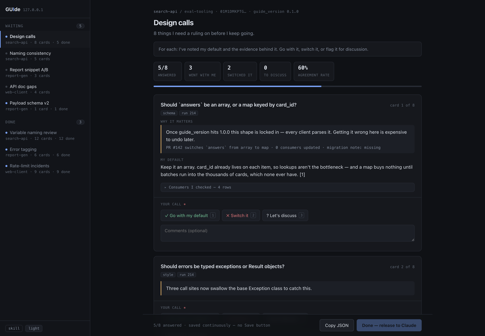
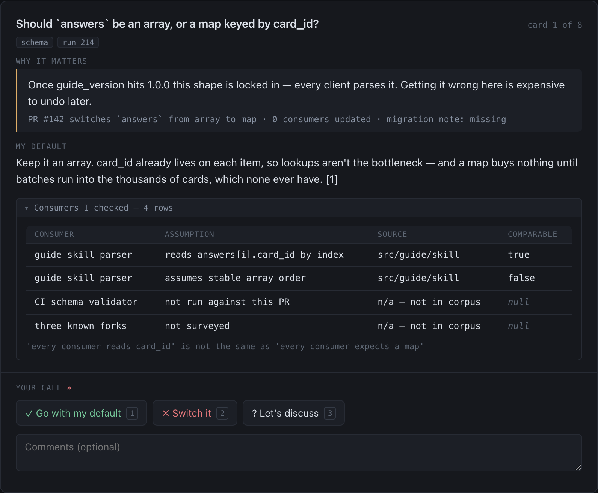
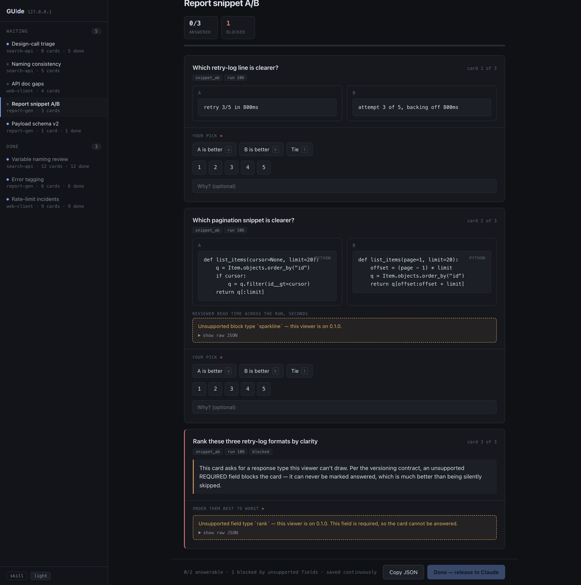
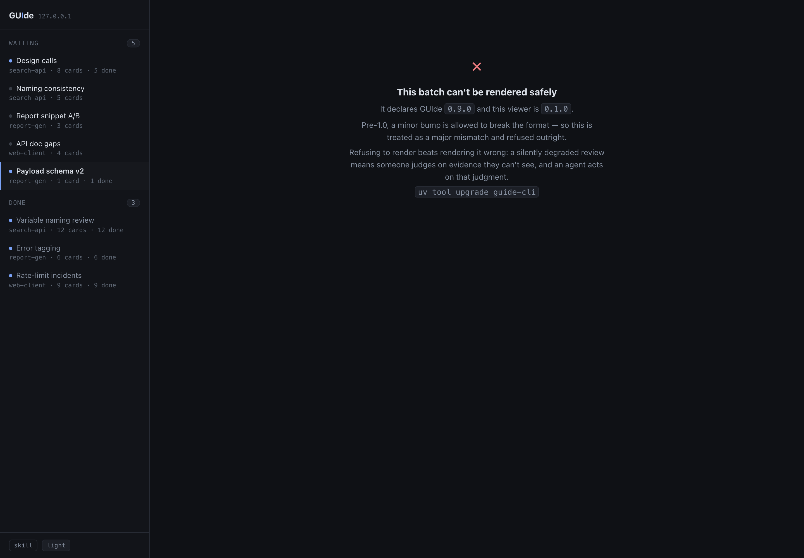
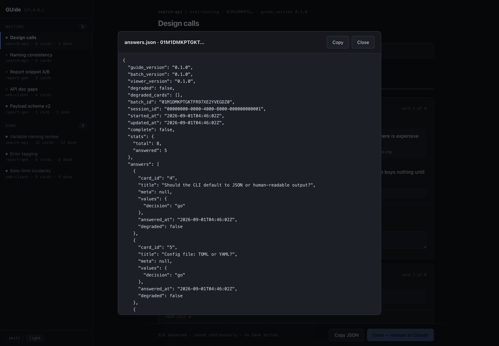

# GUIde

**A local inbox for the questions your agents need answered.**

Claude writes a JSON file: a list of questions, each with the evidence needed to answer
it. It pushes that to `guide`, running on your own machine. A browser page shows an
inbox of everything waiting — from every Claude session you have open — and renders
each question as a card with buttons. You click through them. It writes your answers
back to a JSON file. Claude reads it and keeps working.

That's the whole product.

## The words

Four terms, used consistently everywhere in these docs:

| Term        | What it is                                                                 |
| ----------- | -------------------------------------------------------------------------- |
| **batch**   | One JSON file — a list of questions an agent wants answered, with evidence |
| **card**    | One question in that batch, as drawn on screen: title, evidence, buttons   |
| **answers** | The JSON file that comes back out when you're done                         |
| **inbox**   | Every batch currently waiting on you, across all your sessions             |

## Why

Agents are good at generating 200 things that need a human judgment call, and terrible
at getting those judgments back. Today's options are all bad:

- **Ask in chat, one at a time** — burns context, loses your place, no progress state.
- **Dump a markdown table** — unreadable past ~10 rows, nowhere to attach evidence.
- **Build a one-off HTML page** — works great, which is the problem. You rebuild it
  every time, and the review data ends up welded to the review UI.

That last one is what this generalizes. It came from
a hand-built `.reviews/verifier-triage.html`: 17 verifier complaints, each with the
question, the answer, the raw data rows the agent had, and three buttons. It worked
well enough to obviously be a tool rather than a file.

## Shape

```
  Claude (search-api)  ─┐
  Claude (web-client)  ─┼─▶  guide daemon  ─▶  browser: an inbox of batches
  Claude (report-gen)  ─┘    127.0.0.1:7777     you work through them in any order
                                  │
                                  └──▶ answers.json ──▶ back to whichever session asked
```

Everything runs on your machine. No accounts, no hosting, no shared server, no auth.
Nobody gets a link — they install it and run their own copy for their own agents.

## Install

```sh
# uv is a single static binary; it manages its own Python and touches nothing else
curl -LsSf https://astral.sh/uv/install.sh | sh

git clone https://github.com/AStrayByte/GUIde && cd GUIde
uv tool install --from . guide-cli   # puts `guide` on your PATH, in its own env
guide skill install                  # teach Claude Code to use it
```

Not on PyPI yet — when it is, that middle line becomes `uv tool install guide-cli`.
`uvx --from . guide status` runs it without installing anything at all.

Then, from anywhere:

```sh
guide push ./questions.json      # starts the daemon if it isn't running
guide open                       # the inbox, in a browser
guide wait <id>                  # blocks until you press Done, then prints the answers
```

`guide skill install` writes the Claude Code skill. If you would rather your agent did
it — or would rather read it first — open <http://127.0.0.1:7777/skill>, which offers
four ways in, including a prompt to paste into any Claude session.

## What it looks like

Screenshots below are from the clickable mock that preceded the build; the shipped page
is a direct port of it. The sample batches are deliberately ridiculous — the point is
the shape, not the subject.



Several agent sessions push into one inbox. The left rail groups by repo and survives
the sessions that filled it. The header counters and the false-alarm rate are declared
by the batch — the renderer doesn't know what a "cried wolf" is.



One judgment per card, with the evidence needed to make it. Bulky data collapses behind
one line, so cards stay scannable. Every card in this batch shares a single
`defaults.response` declaration rather than repeating it eight times.



When the viewer meets something it can't draw, it says so **on the card where it
happened** and hands you the raw JSON. An unsupported *required* field blocks its card
outright — better an obviously-stuck card than a silently skipped one.



A version mismatch it can't handle safely is refused rather than half-rendered. A
silently degraded review means someone judges on evidence they can't see, and an agent
acts on that judgment.



What goes back to Claude. `title` and `meta` are echoed verbatim so the answers file is
actionable without the original batch in context, and `degraded` tells the agent whether
to trust it.

## Status

**Phase 1 is built** — the daemon, the inbox, the page, the CLI and the skill.
Python 3.11+, three dependencies, no build step, 196 tests.
[Phase 2](docs/roadmap.md) is the live loop.

### If you're new to the codebase

Start with the **[engineering wiki](docs/wiki/index.html)** — five pages, opens straight
from a clone with no server:

| Wiki page                                              |                                             |
| ------------------------------------------------------ | ------------------------------------------- |
| [Overview](docs/wiki/index.html)                       | What it is, and how to run it               |
| [A batch, end to end](docs/wiki/walkthrough.html)      | Follow one push all the way through         |
| [The file system](docs/wiki/filesystem.html)           | Every file, and where a new one goes        |
| [How it's built](docs/wiki/architecture.html)          | The seams, and the rules that keep them     |
| [Why it's built that way](docs/wiki/decisions.html)    | Seven ADRs, summarised, with what they cost |

### The design docs

| Doc                                              |                                                        |
| ------------------------------------------------ | ------------------------------------------------------ |
| [docs/architecture.md](docs/architecture.md)     | The _product_ architecture — and why it's this small   |
| [docs/format.md](docs/format.md)                 | The batch + answers JSON, annotated                    |
| [docs/versioning.md](docs/versioning.md)         | The version declaration and what happens on a mismatch |
| [docs/claude-side.md](docs/claude-side.md)       | How Claude writes a batch and reads answers            |
| [docs/roadmap.md](docs/roadmap.md)               | Three phases                                           |
| [docs/decisions/](docs/decisions/)               | ADRs — the durable record of every decision            |
| [docs/open-questions.md](docs/open-questions.md) | What's still undecided                                 |
| [schema/](schema/)                               | Machine-readable contract                              |
| [examples/](examples/)                           | Sample batches — synthetic data only, always           |

## Developing

```sh
uv sync                        # ./.venv, with a managed Python 3.12
uv run pytest                  # 196 tests, in about a second
uv run ruff check src tests
uv run guide serve             # the daemon, in the foreground
```

`GUIDE_HOME` relocates the whole store, which is how the test suite stays away from a
real `~/.guide`.
